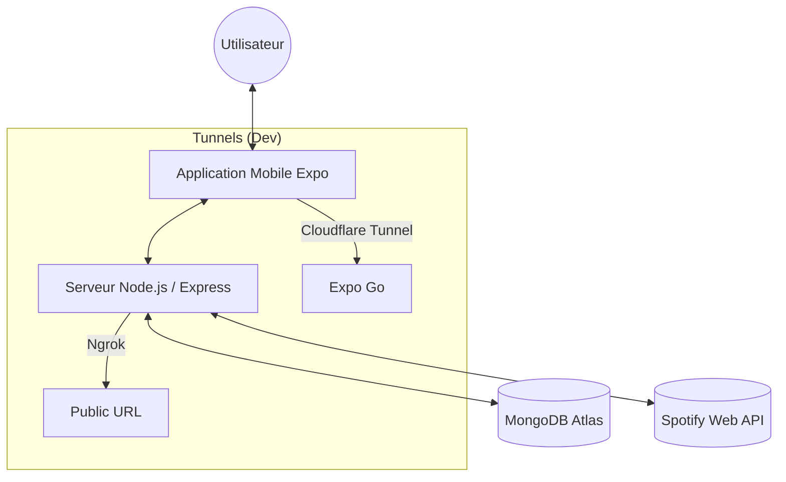

# 🎵 Spotify Party — The Ultimate Shared Jukebox

**Spotify Party** est une application full-stack permettant à un groupe d'amis de collaborer en temps réel sur une file d'attente musicale Spotify. Un "Host" crée une session, et tous les invités peuvent chercher et ajouter des titres directement depuis leur téléphone !

---

## 🏗️ Architecture Technique (Solution "Golden")

Nous utilisons une architecture hybride optimisée pour le travail en équipe et la stabilité de l'authentification :

-   **Backend (Ngrok)** : Le serveur API utilise un tunnel Ngrok (statique ou dynamique). Le script de démarrage détecte automatiquement l'URL configurée dans votre `.env`.
-   **Mobile (Cloudflare + Config locale)** : Expo Go est exposé via un tunnel Cloudflare. Chaque développeur possède son propre fichier `mobile/config.js` pour pointer vers son propre backend.
-   **Proxy OAuth Dynamique** : L'app mobile communique son URL actuelle au backend pour assurer des redirections OAuth fluides, peu importe le tunnel utilisé.

### 📊 Flux de Données



---

## 🚀 Guide de Démarrage (Nouveau Développeur)

### 1. Installation
Installez les dépendances à la racine du projet :
```bash
npm install
```

### 2. Configuration Environnement
Copiez les fichiers d'exemple et remplissez-les avec vos propres accès :

**Pour le Backend :**
```bash
cp backend/.env.example backend/.env
```
*Remplissez `SPOTIFY_CLIENT_ID`, `SPOTIFY_CLIENT_SECRET` et mettez votre URL Ngrok personnelle dans `BACKEND_URL`.*

**Pour le Mobile :**
```bash
cp mobile/config.js.example mobile/config.js
```
*Mettez votre URL Backend Ngrok (finissant par `/api`) dans ce fichier.*

### 3. Lancer le Projet (Commande Maîtresse)
Lancez tout le projet (Backend + Serveur + Tunnels + Expo) en une seule commande :
```bash
npm run start:all
```
*Le script détectera automatiquement si vous avez un domaine Ngrok statique réservé ou s'il doit en créer un dynamique.*

### 4. Rejoindre la fête
Scannez le QR Code affiché par Expo Go avec l'application sur votre téléphone (iOS/Android).

---

## 🔐 Configuration Spotify Dashboard

Pour que l'authentification fonctionne pour **tous les développeurs** de l'équipe :
1.  Allez sur le [Spotify Developer Dashboard](https://developer.spotify.com/dashboard).
2.  Dans votre App, allez dans **Settings**.
3.  Ajoutez chaque URL de développeur dans la liste des **Redirect URIs** :
    - `https://votre-domaine-perso.ngrok-free.dev/api/auth/callback`
4.  **Sauvegardez**. Spotify acceptera les connexions venant de n'importe laquelle de ces adresses.

---

## 🛠️ Outils de Développement

- **Logs** : Les logs du serveur sont disponibles dans `backend_server.log`. Les logs des tunnels sont dans `cf_mobile.log`.
- **VS Code** : Utilisez la configuration de lancement `🔥 Launch All` dans l'onglet Debug pour démarrer plus vite.
- **Scripts de secours** :
  - `npm run dev` : Lancement standard sans tunnels complexes.
  - `npm run start:mobile` : Lance uniquement le tunnel mobile et Expo.

---
> [!IMPORTANT]
> Ne commissionnez (**git push**) jamais vos fichiers `.env` ou `mobile/config.js`. Ils sont dans le `.gitignore` pour protéger vos identifiants personnels.